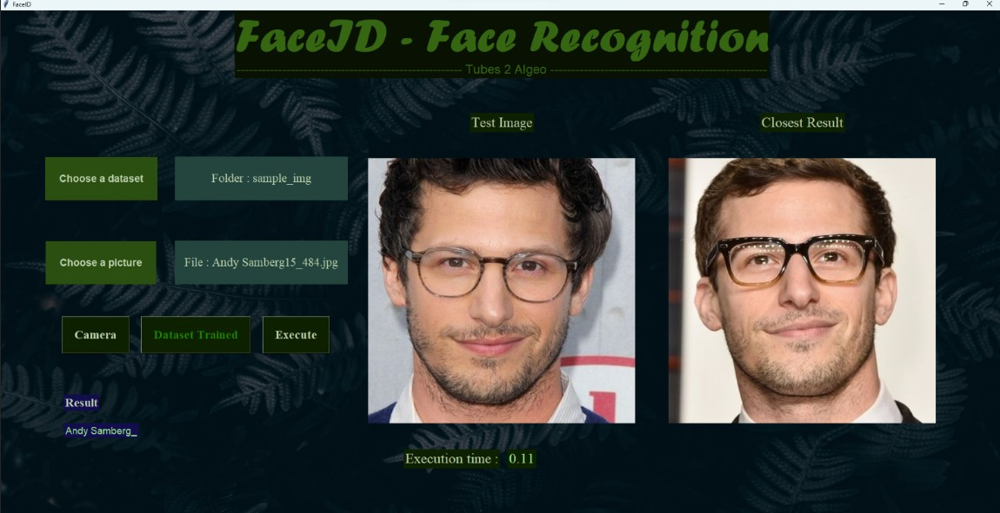

# Algeo02-21043
Tugas Besar 2 IF 2123 Aljabar Linier dan Geometri Aplikasi Nilai Eigen dan EigenFace pada Pengenalan Wajah (Face Recognition Semester I Tahun 2022/2023

## Table of Contents
* [General Info](#general-information)
* [Technologies Used](#technologies-used)
* [Features](#features)
* [Screenshots](#screenshots)
* [Setup](#cara-menjalankan-program)
* [Project Status](#project-status)
* [Room for Improvement](#room-for-improvement)
* [Pembagian](#pembagian-tugas)

## General Information
Pengenalan wajah (Face Recognition) adalah teknologi biometrik yang bisa dipakai untuk mengidentifikasi wajah seseorang untuk berbagai kepentingan khususnya keamanan. Program pengenalan wajah melibatkan kumpulan citra wajah yang sudah disimpan pada database lalu berdasarkan kumpulan citra wajah tersebut, program dapat mempelajari bentuk wajah lalu mencocokkan antara kumpulan citra wajah yang sudah dipelajari dengan citra yang akan diidentifikasi.

## Technologies Used
- python - version 3.7
- opencv-python - version 4.6.0.66
- numpy - version 1.21.6
- mediapipe - version 0.9.0
- matplotlib - version 3.5.3
- tkinter - version 0.1.0
- PIL - version 9.3.0

## Features
List the ready features here:
- Insert Image and Dataset 
- Camera
- Train dataset

## Screenshots

## Cara menjalankan program 
1. Buka terminal pada direktori folder src yang berisi main.py 
2. Jalankan program dengan command "py -3.7 -m  main.py" (program ini meggunakan versi python 3.7 untuk menjalankannya, kecuali jika terdapat library mediapipe pada python versi yang lebih tinggi)
3. Terdapat beberapa opsi-opsi yang dapat dilakukan untuk deteksi wajah yaitu :

    a. Jika pengguna hanya ingin mendeteksi wajah satu kali dengan dataset yang siberikan maka, pengguna dapat memasukkan dataset dan test image yang ingin dideteksi wajahnya. Kemudian menekan tombol execute untuk memulai pendeteksian. Hasil gambar akan keluar pada bagian result image dan nama hasil wajah akan tampil pada bagian result di pojok kiri bawah. 

    b. Jika pengguna ingin melakukan tes uji untuk banyak test image dengan dataset yang sama. Memasukkan dataset terlebih dahulu kemudian menekan train image agar hasil pre-processing dari dataset dapat tersimpan selama tidak ada dataset baru yang ingin diuji. Setelah itu pengguna dapat memasukkan test image - tes image yang ingin diuji lalu menekan execute. Program akan dengan cepat melakukan identifikasi dan menampilkan hasilnya. 

    c. Jika pengguna ingin langsung menggunakan kamera untuk pendeteksian wajah, maka pengguna dapat menggunakan fitur tambahan yaitu terdapat tombol camera untuk memasukkan test image secara real time dengan kamera laptop atau komputer pengguna. Untuk selebihnya seperti train dataset terlebih dahulu atau tidak tetap bisa dilakukan seperti pada poin a dan b hanya berbeda di bagian input gambar yang digantikan dengan penangkapan gambar secara langsung dengan kamera. Ketika tombol kamera ditekan, tombol input test image berupa file akan langsung dimatikan (tidak bisa ditekan)  selama kamera menyala. 

## Project Status
Project is: _complete_ 

## Room for Improvement

Room for improvement:
- speed up the pre-processing of dataset 
- speed up identification image

## Pembagian Tugas
1. Nigel Sahl (13521043)                : Fungsi mean, fungsi selisih, fungsi identifikasi wajah dengan dataset, dan program utama dalam GUI, menambah file-file dalam dataset menjadi list  
2. Muhammad Naufal Nalendra (13521152)  : Fungsi Resize image, konversi RGB menjadi Greyscale, dan penyusunan flatvector matriks citra, fungsi crop wajah, dan change background
3. Hanif Muhammad Zhafran (13521157)    : Fungsi Eigenvalue, fungsi Eigenvector, dan fungsi Eigenface, mengoptimalisasi deteksi wajah  
